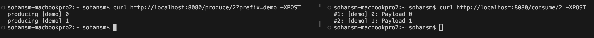

# Introduction

This is a demo `produce` and `consume` app for `Apache Kafka`. Both the app and Kafka run on containers,
for local dev using `docker-compose`, and deploy to Google Cloud Platform using `Terraform`.



We have three distinct containers as follows:
1. The `kafka` container - is the Kafka server.
2. The `consumer` container - is an always-on consumer listening to messages on a topic.
3. The `app` container - that exposes a HTTP API to publish some messages

Locally, all three containers run on docker-compose. In GCP, the Kafka container runs on Google Compute Engine. The app and consumer run as a part of the same Cloud Run app. The app satisfies the Cloud Run service contract by listening to port 8080 to serve HTTP traffic. The consumer runs as a side-car, listening to the Kafka topic on the background. The Cloud Run app is set to use min and max instance of 1 with `cpu_idle` set to false. This keeps the Cloud Run multi-container app running.

You can disable the consumer app locally, and use the `/consume` HTTP endpoints to consume messages. This can be useful to understand how `/lag` works. The `consumer` app adds an aritifical `sleep` to mimic some processing time for each message.

## Local Development

Install `docker-compose` and you're all set.

```bash
# Start kafka and the app containers
$ docker-compose up -d
# Shell into the app container
$ docker-compose exec app bash
# Call the API endpoints from your host, outside the docker shell
$ curl http://localhost:8080
# See the number of unread messages in the topic
$ curl http://localhost:8080/lag
# Produce 10 messages
$ curl http://localhost:8080/produce/10 -XPOST
# Produce 10 messages with a prefix
$ curl http://localhost:8080/produce/10?prefix=GAGA -XPOST
# Produce 1_000 messages, by default
$ curl http://localhost:8080/produce -XPOST
```

## Deploy to GCP
```bash
# Build and deploy
$ ./deploy.sh
# will allow you to access the Cloud Run service locally
$ gcloud run proxy kfk --region us-central-1
# Now you can all the endpoints as your dev environment
$ curl http://localhost:8080/...
```
